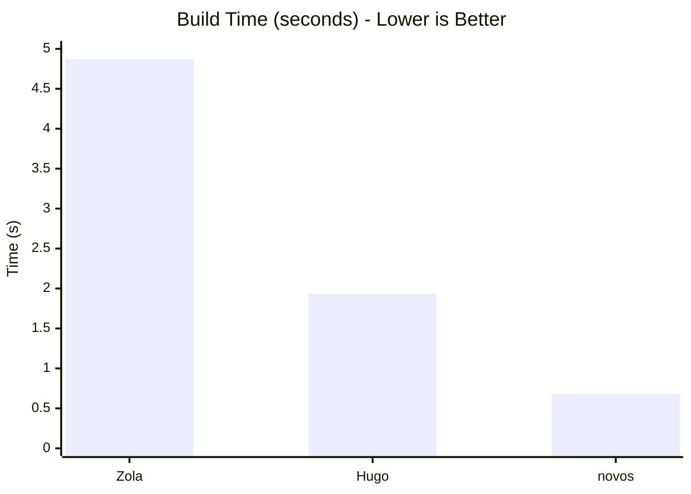

<div align="center">

# **novos**


**Build at the speed of thought.**


</div>

> [!WARNING]
> **novos** is currently beta software. Expect frequent updates and potential breaking changes as we approach v1.0.

## What is novos?
novos is a lightning-fast static site generator (SSG) built in Rust. It takes your Markdown files and turns them into a website in milliseconds.

## Features
- **Sass transpilation** via native `grass` (no C++ or Node.js required)
- **Fast Parallelism** utilizing `Rayon` for multi-core page generation
- **Self-Contained** binary with embedded assets via `rust-embed`
- **Shortcodes, Includes, & Variables** for flexible templating
- **RSS** generation baked-in
- **search.json**, so you can search
- **syntect**, because who hates colors?

## Supported OSes

| Tier | Operating System | Notes |
| :--- | :--- | :--- |
| **Tier 1** | **OmniOS CE** | Primary development |
| **Tier 1** | **FreeBSD** | Primary development  |
| **Tier 2** | Ubuntu LTS (Noble) | Verified compatibility |
| **Tier 2** | Arch Linux | Verified compatibility |
| **Tier 2** | Void Linux | Verified compatibility |
| **Tier 3** | macOS (intel/Sillicon) | *"CI compiled it"* |
| **Tier 3** | Windows | *"CI compiled it"* |

## Roadmap
- [x] Parallel page generation
- [ ] Live reload inside dev server
- [X] Theme: Nord-ish
- [ ] Plugin API (WASM + .so)
- [ ] Taxonomies
- [ ] Pagination

## Themes
- Solarnight (sass/solarnight.scss)
  - Solarnight is a Rose Pine inspired theme. 
- Nordish
    - A Nord inspired color palette.
  
## Documentation
Documentation is available at [docs/](./docs)
- [**Get Started**](./docs/SETUP.md): Setup guide for novos
- [**Installation**](./docs/INSTALL.md): Install guide for novos

## Backend
- **Language:** Rust (2024 Edition)
- **Markdown:** `pulldown-cmark` (CommonMark compliant, yay!)
- **License:** 3-Clause BSD

# Performance Benchmarks
(The stress test was generated by [./stress.sh](./stress.sh))

### In text form

```bash
~/dev/stress/sitez $ hyperfine --warmup 3 "zola build"
Benchmark 1: zola build
  Time (mean ± σ):      4.874 s ±  0.014 s    [User: 3.949 s, System: 1.354 s]
  Range (min … max):    4.852 s …  4.895 s    10 runs
~/dev/stress/siten $ hyperfine --warmup 3 "novos build"
Benchmark 1: novos build
  Time (mean ± σ):     675.7 ms ±  14.4 ms    [User: 844.4 ms, System: 1722.4 ms]
  Range (min … max):   660.9 ms … 706.1 ms    10 runs
~/dev/stress/siteh $ hyperfine --warmup 3 "hugo"
Benchmark 1: hugo
00:00:05   Time (mean ± σ):      1.929 s ±  0.018 s    [User: 4.377 s, System: 0.529 s]
  Range (min … max):    1.910 s …  1.966 s    10 runs
```

### In a bar chart


#### How novos achieves < 1s builds:
- **Zero-Copy Parsing**: Leveraging pulldown-cmark's event-based parser.
- **Work-Stealing Parallelism**: Rayon dynamically balances page rendering across all available CPU threads.
- **Sass compilation techniques**: Using native grass avoids the overhead of external process calls to Node or Dart.
